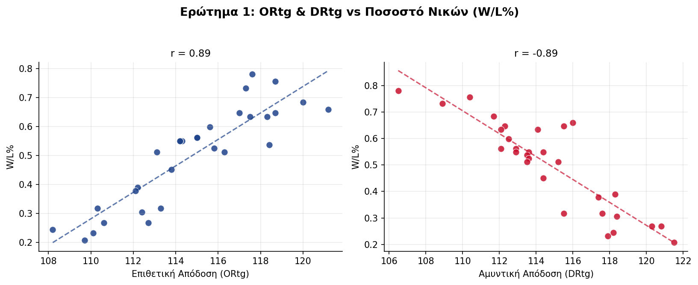
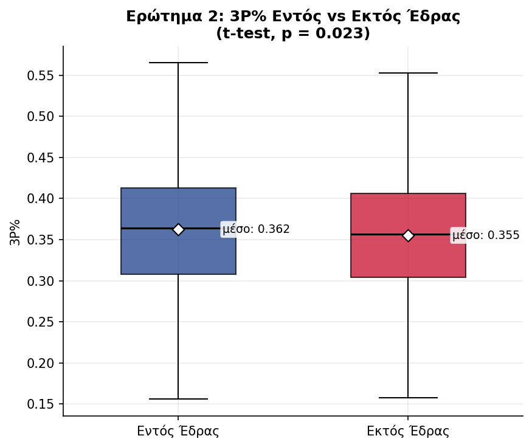
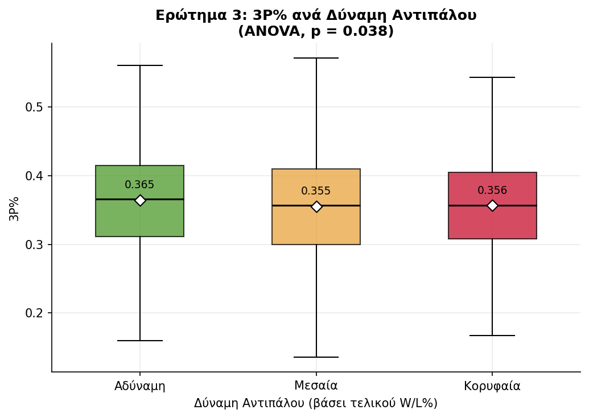

# 🏀 NBA 3PT Analysis — Κερδίζουν περισσότερους αγώνες οι ομάδες που σουτάρουν περισσότερα τρίποντα;
  

Στατιστική ανάλυση της σχέσης μεταξύ στρατηγικής τριπόντων και αγωνιστικής επιτυχίας στο NBA, με **ζωντανό data pipeline** που τραβάει τρέχοντα στατιστικά απευθείας από το επίσημο API του NBA.

Ξεκίνησε ως σχολική εργασία στο μάθημα Στατιστικής (Πανεπιστήμιο Κρήτης) και εξελίχθηκε σε ανεξάρτητο project με πραγματικά, ανανεώσιμα δεδομένα.

## Ερευνητικά Ερωτήματα 

1. **Ποιοι παράγοντες επηρεάζουν περισσότερο την απόδοση μιας ομάδας;** (πολλαπλή παλινδρόμηση, W/L% ~ ORtg, DRtg, Pace, TS%, 3PAr, 3P%)
2. **Σουτάρουν οι ομάδες διαφορετικά τρίποντα Εντός vs Εκτός έδρας;** (t-test, σε επίπεδο αγώνα)
3. **Διαφέρει το 3P% ανάλογα με τη δύναμη του αντιπάλου;** (ANOVA, σε επίπεδο αγώνα)

## Ευρήματα

| Ερώτημα | Αποτέλεσμα |
|---|---|
| 1. Βασικοί παράγοντες απόδοσης | Backward elimination στα ζωντανά δεδομένα καταλήγει σε **ORtg**, **DRtg** και **TS%** (p < 0.05, R² = 0.95) |
| 2. Εντός vs Εκτός έδρας | Στατιστικά σημαντική διαφορά (t-test, p = 0.023) — ελαφρώς καλύτερο 3P% εντός έδρας (36.3% vs 35.5%) |
| 3. Δύναμη αντιπάλου | Στατιστικά σημαντική διαφορά (ANOVA, p = 0.038) — καλύτερο 3P% ενάντια σε αδύναμους αντιπάλους |

## Δομή Project

fetch_nba_data.py       # Τραβάει season-level στατιστικά ομάδων (ORtg, DRtg, Pace, 3PAr, 3P%, TS%)
analyze_regression.py   # Live regression + backward elimination για το Ερώτημα 1
analyze_game_level.py   # Τραβάει per-game δεδομένα και τρέχει τα Ερωτήματα 2 & 3
NBAstats_live.csv        # Output του fetch_nba_data.py
NBA_gamelevel_live.csv   # Output του analyze_game_level.py

## Πώς τρέχει
pip install nba_api pandas scipy statsmodels

python fetch_nba_data.py        # Πρώτα αυτό
python analyze_regression.py    # Ερώτημα 1
python analyze_game_level.py    # Ερωτήματα 2 & 3

Η τρέχουσα σεζόν NBA υπολογίζεται αυτόματα βάσει σημερινής ημερομηνίας — δεν χρειάζεται καμία χειροκίνητη ρύθμιση.

## Μεθοδολογικές Σημειώσεις & Περιορισμοί

- Η αρχική σχολική εργασία εξέταζε τα Ερωτήματα 2 και 3 σε επίπεδο **σεζόν** (30 ομάδες), χρησιμοποιώντας ως proxy το season-level 3P% και W/L%. Αυτή η έκδοση τα εξετάζει σωστά σε επίπεδο **αγώνα** (2400+ παρατηρήσεις), απαντώντας ακριβώς στο ερώτημα όπως τέθηκε αρχικά.
- Η κατηγοριοποίηση "δύναμης αντιπάλου" (Ερώτημα 3) βασίζεται στο **τελικό** W/L% της σεζόν — δηλαδή γνωρίζουμε εκ των υστέρων ποιος ήταν δυνατός, όχι το ρεκόρ τη στιγμή του συγκεκριμένου αγώνα. Αποδεκτή απλοποίηση, αλλά αξίζει να σημειωθεί ως περιορισμός.
- Η μεταβλητή **Age** (μέση ηλικία ρόστερ) και **SOS** (Strength of Schedule) της αρχικής εργασίας παραλείφθηκαν σκόπιμα από το live pipeline: το Age δεν επιβίωσε στο backward elimination του αρχικού μοντέλου (άρα η αφαίρεσή του δεν επηρεάζει τα συμπεράσματα), και το SOS δεν είναι διαθέσιμο μέσω του επίσημου NBA API.
- Το τελικό μοντέλο του Ερωτήματος 1 εμφανίζει ήπια πολυσυγγραμμικότητα μεταξύ ORtg και TS% (αναμενόμενο, καθώς το TS% συμβάλλει στον υπολογισμό του ORtg) — τα αποτελέσματα είναι έγκυρα αλλά η ερμηνεία των επιμέρους συντελεστών πρέπει να γίνεται με προσοχή.

## Δεδομένα

Επίσημο στατιστικό API του NBA (μέσω [`nba_api`](https://github.com/swar/nba_api)), ζωντανά, ανά ζήτηση.

## Τεχνολογίες

Python, pandas, scipy, nba_api

---
Η αρχική στατιστική ανάλυση (σχολική εργασία) εκπονήθηκε από κοινού με τον Χρήστο Ιερωνυμάκη. Το ζωντανό data pipeline, η επέκταση σε game-level ανάλυση και η διόρθωση των Ερωτημάτων 2-3 αναπτύχθηκαν ανεξάρτητα από τη Σκιαδά Καθολική.
---
*Σκιαδά Καθολική*
